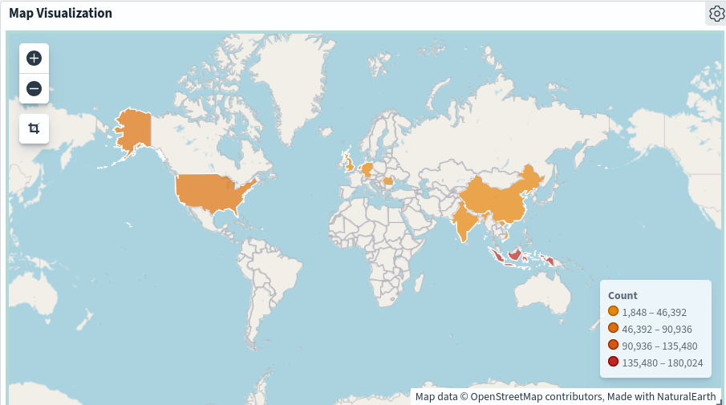
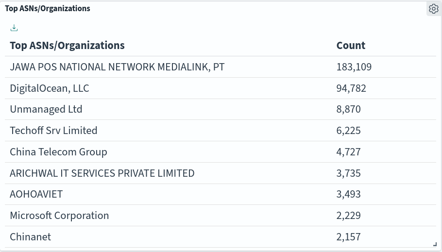
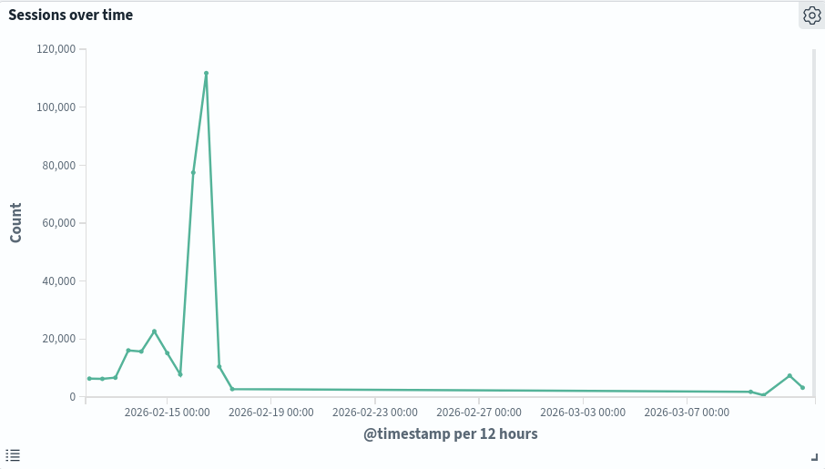
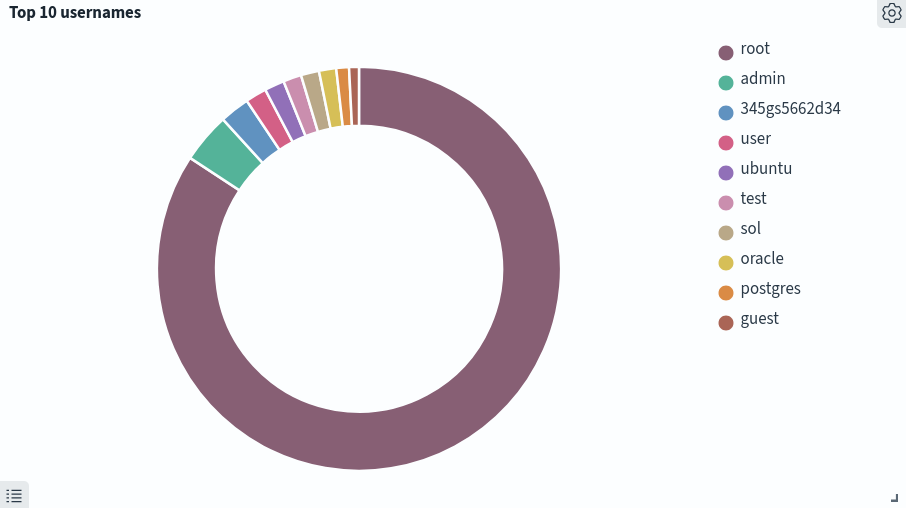
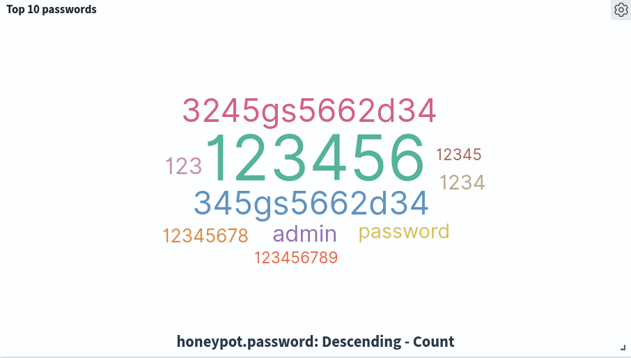

# Cowrie SSH Honeypot — Research Overview

A research project analyzing real-world SSH attack patterns using a [Cowrie](https://github.com/cowrie/cowrie) honeypot deployed on a public-facing instance. All data was collected in a controlled environment for threat intelligence purposes.

Over the observation period of a month, the honeypot recorded sustained brute force attempts and post-authentication malware deployment from multiple source IPs.

---

## Setup & Infrastructure

| Property | Detail |
|----------|--------|
| **Cloud Provider** | Google Cloud Platform |
| **Instance Type** | e2-medium (2 vCPUs, 4 GB RAM) |
| **OS** | Ubuntu 22.04 LTS |
| **Target Port** | 22 (SSH) |
| **Protocol** | SSH / SFTP |

Cowrie logs were shipped via Filebeat → Logstash → OpenSearch, with visualization through OpenSearch Dashboards.

---

## Findings

### Attack Origins



The top countries by session volume were **Indonesia** (180,024), the **Netherlands** (57,202), and the **United States** (43,150).



### Session Activity



On 2026-02-16, a single source IP generated a massive spike in SSH sessions, peaking at over 8,000 sessions per 30 minutes and totaling over 110,000 sessions within a 15-hour window. The sheer number of sessions along with the hard start (~07:30) and hard stop (~22:00) seems to indicate a scheduled or manually activated script operating within a fixed timezone.

### Credentials Attempted



The top three usernames were `root`, `admin`, and `345gs5662d34`. The popularity of usernames "root" and "admin" makes sense, as they serve as placeholders for system access; however, `345gs5662d34` stands out as a unique and increasingly popular username/password combination targeting SSH and IoT devices. Current theories are that these credentials are used as part of a botnet or as a method for honeypot detection.



The most frequent passwords were `admin`, `password`, and variations of `123456`, consistent with [NordPass' Most Common Passwords List](https://nordpass.com/most-common-passwords-list/).

### Threat Clusters
Two distinct post-authentication campaigns were identified: a widespread scanning/uploading of a generic sshd binary and a more sophisticated multi-architecture malware deployment by a single actor.

**Cluster A — Trojanized SSH Daemon**
- 13 source IPs uploaded a fake `sshd` binary designed to replace the legitimate SSH daemon
- The purpose of the trojan is to ensure persistent backdoor access for the purpose of cryptojacking
- 8 unique malware variants observed, suggesting active maintenance across campaigns

**Cluster B — Redtail Cryptominer Campaign**
- IP `213.209.159.158` returned on 3 separate days with an identical toolkit
- Deployed cryptominer binaries for 4 CPU architectures: `arm7`, `arm8`, `i686`, `x86_64`
- The uploaded binaries were confirmed as Redtail cryptomining malware via SHA256 hash verification on VirusTotal, targeting multiple architectures (arm7, arm8, i686, x86_64) with the intent of mining Monero (XMR).
- Accompanied by `clean.sh` (log removal) and `setup.sh` (persistence installation)

---

## Repository Structure

```
├── README.md   -   Overview Report
├── report.md   -   Technical Report
└── images/
    ├── common-usernames.png
    ├── common-passwords.png
    ├── top-orgs.png
    ├── region-map.png
    └── sessions-over-time.png
└── raw/
    ├── cowrie-file-hash.txt
    └── wordlist.txt

```

---

*All data collected in a controlled honeypot environment for research and threat intelligence purposes.*
