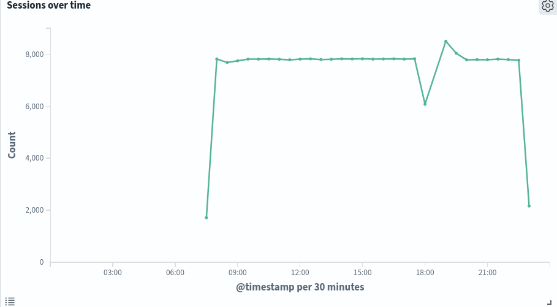

# Cowrie SSH Honeypot — Threat Intelligence Report

1. [Setup & Environment](#setup--environment)
2. [Attack Overview & Timeline](#attack-overview--timeline)
3. [Credential Analysis](#credential-analysis)
4. [Post-Authentication Behaviour & Malware Analysis](#post-authentication-behaviour--malware-analysis)
5. [Attacker Profile](#attacker-profile)
6. [Indicators of Compromise](#indicators-of-compromise)

---
## Setup & Environment

### Infrastructure

| Property | Detail |
|----------|--------|
| **Cloud Provider** | Google Cloud Platform |
| **Instance Type** | e2-medium (2 vCPUs, 4 GB RAM) |
| **OS** | Ubuntu 22.04 LTS |
| **Target Port** | 22 (SSH) |
| **Protocol** | SSH / SFTP |

### Log Pipeline

Cowrie logs were shipped in real time via Filebeat and Logstash into OpenSearch, with OpenSearch Dashboards used for visualization and analysis.

---

## Attack Overview & Timeline

### Summary

A single IP address from a residential ISP was detected performing a sustained, high-volume SSH brute force attack against the honeypot for approximately 15 hours on 2016-02-16. The attack was fully automated, consistent in session volume, and demonstrated behavioral patterns characteristic of a scheduled or manually triggered script. 

### Session Volume



On 2026-02-16, a single source IP from Indonesia generated a massive spike in SSH sessions, peaking at over 8,000 sessions per 30 minutes and totaling over 110,000 sessions within a 15-hour window. The sudden spike in SSH sessions and the length of the attack is indicative of an automated brute force attack (MITRE T1110.001). 

### Timeline

| Time | Event |
|------|-------|
| ~07:30 | Attack begins: sessions spike from near-zero to ~7,800 sessions per 30 minutes. |
| ~16:30 | Brief dip in session count, quickly recovered |
| ~19:00 | Minor spike above baseline (~8,500), returning to baseline |
| ~22:00 | Attack cessation: sessions drop sharply, attack ends |

### Key Observations

- The flat session rate is characteristic of an automated tool operating at a fixed rate
- Sudden start and stop suggests manual execution or a cron-scheduled job
- Operating hours (8:00-22:00) align with typical business hours, which could suggest the attacker is operating within a specific timezone
- Source IP was traced to a residential ISP, which is consistent with a compromised home machine or residential proxy

---

## Credential Analysis

### Username Targeting

Every observed login attempt used the username `root` exclusively. This is consistent with opportunistic attacks targeting:

- Poorly configured Linux servers with root SSH login enabled
- IoT devices and home servers with default credentials
- Systems set up by non-technical users

### Password Pattern

The passwords revealed that this was a dictionary attack, rather than a traditional brute force attack. In addition to standard passwords like `123456` and `zhoujing`, some of the observed passwords followed a date of birth (DOB) format matching `DDMMYYYY` or `YYYYMMDD`. The birth years observed range primarily from the **1970s to early 1990s**, suggesting a wordlist targeting working-age adults who may use their own birthdate as a password.

**Sample captured passwords:**

```
zhaofeng
123987456
19800216
sl123456
19791029
likelike
19850517
19900307
zhan1234
happy2009
xinxinxin
```

### Wordlist Assessment

- The wordlist consists of a variety of common passwords, including names, numbers, common words, and birth dates. 
- While these passwords are simple, they remain common among non-technical users.
- A sample 10,000 line wordlist of the observed passwords is available under `raw/wordlist.txt`.

---

## Post-Authentication Behaviour & Malware Analysis

Upon gaining access, attackers uploaded malicious payloads via SFTP. Two distinct threat clusters were identified.

### Cluster A — Trojanized SSH Daemon (`sshd`)

Multiple source IPs uploaded a file named `sshd`, a fake SSH daemon designed to replace the legitimate system binary. This serves two purposes: establishing a persistent backdoor that survives reboots, and harvesting credentials from all future SSH logins on the compromised host.

Several unique variants were observed (differing SHA256 hashes), suggesting the malware is actively maintained or compiled per-campaign.

| SHA256 | Source IP | Timestamp |
|--------|-----------|-----------|
| `9e9aa0b5...` | 113.0.152.164 | 2026-03-11 14:39 UTC |
| `274e1f6f...` | 180.76.167.130 | 2026-03-11 16:47 UTC |
| `94f2e4d8...` | Multiple IPs | Feb 13–16 2026 |
| `1bd3745a...` | 219.144.80.143 | 2026-02-17 01:48 UTC |
| `bd6583cd...` | 203.189.196.168 | 2026-02-17 07:51 UTC |
| `d44144ff...` | 61.240.17.66 | 2026-02-17 18:10 UTC |
| `b5afdf7d...` | 118.121.203.170 | 2026-02-15 15:51 UTC |
| `6b5afe50...` | 223.108.185.218 | 2026-03-12 00:42 UTC |

---

### Cluster B — Redtail Cryptominer Campaign (IP: `213.209.159.158`)

This is the most significant threat actor observed. A single IP (`213.209.159.158`) conducted **repeated sessions across multiple days**, uploading a consistent toolkit each time.

**Campaign activity dates:** Feb 14, Feb 16, Feb 17 2026

#### Payload Toolkit

| Filename | SHA256 | Purpose |
|----------|--------|---------|
| `redtail.arm7` | `3625d068...` | Cryptominer binary — ARM v7 |
| `redtail.arm8` | `dbb7ebb9...` | Cryptominer binary — ARM v8 |
| `redtail.i686` | `048e374b...` | Cryptominer binary — x86 32-bit |
| `redtail.x86_64` | `59c29436...` | Cryptominer binary — x86 64-bit |
| `clean.sh` | `d46555af...` | Track-covering / cleanup script |
| `setup.sh` | `783adb7a...` | Installation & persistence script |

#### Analysis

**Redtail** is a known cryptomining malware family. Key observations:

- **Multi-architecture targeting** — deploying ARM7, ARM8, i686, and x86_64 binaries simultaneously allows the attacker to mine on whatever hardware they find, from cloud VMs to IoT/embedded devices
- **`clean.sh`** — removes logs, kills competing miners, and erases traces of the intrusion
- **`setup.sh`** — installs the appropriate binary, establishes cron persistence, and may disable security tooling
- **Identical SHA256 hashes across sessions** — the same payload bundle was deployed on Feb 14, 16, and 17, indicating an **automated, scripted campaign** hitting targets in bulk
- The repeat visits from the same IP suggest either the honeypot was flagged as a "confirmed accessible" host in their infrastructure, or the attacker runs periodic re-infection sweeps

---

## Attacker Profile

### Assessment

Two distinct attacker profiles were identified across the observation period.

**Cluster A - Opportunistic SSH Backdoor Operators**

| Attribute | Assessment |
|-----------|-----------|
| Skill level | Medium  |
| Targeting | Opportunistic internet scanning |
| Tooling | Trojanized `sshd` binary + Modified XMRig miner |
| Intent | Persistent access, credential theft, cryptojacking |
| Operational security | Medium — no IP rotation, residential/ISP IPs, but highly sophisticated trojan |

**Cluster B - Redtail Cryptominer Campaign (`213.209.159.158`)**

| Attribute | Assessment |
|-----------|-----------|
| Skill level | Medium - organized, automated, multi-architecture |
| Targeting | Opportunistic, broad SSH scanning |
| Tooling | Full toolkit: miner binaries for 4 architectures, installer, cleanup script |
| Intent | Cryptomining (likely Monero) |
| Operational security | Medium — relies on single persistent IP, but mitigates risk with automated deployment scripts that can quickly re-infect or update payloads |
| Campaign pattern | Repeat visits to confirmed-accessible hosts across multiple days |

### Upgraded Threat Assessment

> These are two distinct but related threat clusters that are actively targeting internet-exposed SSH services for the purpose of cryptomining. Cluster A focuses on persistent access and credential theft via trojanized SSH daemons, while Cluster B operates an automated, multi-architecture cryptojacking campaign. These are highly sophisticated malware and not the work of a script kiddie.

### Attribution Confidence

> **Low.** No definitive attribution is possible from honeypot data alone. Source IPs may represent compromised intermediary hosts rather than the actual threat actors' infrastructure.

---

## Indicators of Compromise

### Source IPs Observed

| IP Address | Activity | Dates |
|------------|----------|-------|
| `213.209.159.158` | Redtail cryptominer campaign (repeat) | Feb 14, 16, 17 2026 |
| `223.108.185.218` | Trojanized sshd upload | Mar 12 2026 |
| `113.0.152.164` | Trojanized sshd upload | Mar 11 2026 |
| `180.76.167.130` | Trojanized sshd upload | Mar 11 2026 |
| `219.144.80.143` | Trojanized sshd upload | Feb 17 2026 |
| `203.189.196.168` | Trojanized sshd upload | Feb 17 2026 |
| `61.240.17.66` | Trojanized sshd upload | Feb 17 2026 |
| `77.22.70.198` | Trojanized sshd upload | Feb 16 2026 |
| `138.197.163.192` | Trojanized sshd upload | Feb 15 2026 |
| `118.121.203.170` | Trojanized sshd upload | Feb 15 2026 |
| `171.244.142.233` | Trojanized sshd upload | Feb 13 2026 |
| `115.231.236.150` | Trojanized sshd upload | Feb 13 2026 |
| `43.163.8.150` | Trojanized sshd upload | Feb 13 2026 |

### File Hashes (SHA256)

| Filename | SHA256 |
|----------|--------|
| `redtail.arm7` | `3625d068896953595e75df328676a08bc071977ac1ff95d44b745bbcb7018c6f` |
| `redtail.arm8` | `dbb7ebb960dc0d5a480f97ddde3a227a2d83fcaca7d37ae672e6a0a6785631e9` |
| `redtail.i686` | `048e374baac36d8cf68dd32e48313ef8eb517d647548b1bf5f26d2d0e2e3cdc7` |
| `redtail.x86_64` | `59c29436755b0778e968d49feeae20ed65f5fa5e35f9f7965b8ed93420db91e5` |
| `clean.sh` | `d46555af1173d22f07c37ef9c1e0e74fd68db022f2b6fb3ab5388d2c5bc6a98e` |
| `setup.sh` | `783adb7ad6b16fe9818f3e6d48b937c3ca1994ef24e50865282eeedeab7e0d59` |
| `sshd` (variant 1) | `9e9aa0b5011786bb4e214e22e05a964c83da8e4de25fc3b2358767faf1011e24` |
| `sshd` (variant 2) | `274e1f6f6cf624499aa1540fae94cf0fa939985fca724c080f47cd5a64bc1e2c` |
| `sshd` (variant 3) | `94f2e4d8d4436874785cd14e6e6d403507b8750852f7f2040352069a75da4c00` |
| `sshd` (variant 4) | `1bd3745a4f9043ead807d7777669b0dbf5b56985e5b3dd9d7cff8384154ea4a8` |
| `sshd` (variant 5) | `bd6583cdaacb71efe80c568a359b434a084b471f46e080255feecef54577bad3` |
| `sshd` (variant 6) | `d44144ffbe3f08ed159f7f977ec84b63f1895fc451c4d77ae09d3f8bf4b5821a` |
| `sshd` (variant 7) | `b5afdf7d2bd35e0b61c315ebb78164a785326cc12fd8e1c0b601ab9525101094` |
| `sshd` (variant 8) | `6b5afe506c5b4db4094797166a92021271a623af48f1d476185858264909d8c7` |

---

## Appendix

### Tools & Environment

- **Honeypot software:** [Cowrie](https://github.com/cowrie/cowrie)
- **Visualization:** Session data plotted per 30-minute timestamp bucket via OpenSearch Dashboards

### Recommended Mitigations (for production systems)

- Disable root SSH login (`PermitRootLogin no` in `sshd_config`)
- Enforce SSH key-based authentication only
- Rate-limit or block IPs exceeding a threshold of failed attempts (e.g. via `fail2ban`)
- Enforce a strong password policy that ensures cryptographically secure password.

---

*All data collected in a controlled honeypot environment for research and threat intelligence purposes.*
